# alexa-skill-tutorial
An AWS self-hosted demo skill for Amazon Alexa written in Typescript.

## Main Goals

- Develop an Alexa Skill with Typescript.
- Self-host the skill-backend on AWS using Lambda as endpoint.
- Automate the workflow as much as possible.
- Implement tests and use additional tools to improve code quality.
- Describe the workflow in as much detail as needed for future reference.

## Prerequisites

To set up the whole environment you will need:

- Account with [Amazon Web Services (AWS) - Cloud Computing Services](https://aws.amazon.com). Make sure you set up [Multi-Factor Authentication](https://aws.amazon.com/iam/details/mfa/) to ensure account security!
- [Node.js® JavaScript runtime](https://nodejs.org/en/) installed on your local machine.
- [AWS Command Line Interface](https://aws.amazon.com/cli/) installed on your local machine.
- [Terraform](https://learn.hashicorp.com/terraform/getting-started/install.html) installed on your local machine.
- [This repository](https://github.com/henrythasler/alexa-skill-tutorial.git) cloned to your local machine.

This tutorial assumes that you have all this set up and ready to use.
## AWS Credentials for terraform

- In AWS Console: go to IAM, create a new user and create an access key for that user
- Make sure this terraform user has the required permissions to execute the instructions during `terraform apply`.
- On your local machine: run `aws configure` and enter the access keys incl. secret key as prompted.

## Terraform Initialization

- in `infrastructure/state.tf`: change the values according to your setup to use [another (remote) backend](https://www.terraform.io/docs/backends/index.html) or remove this file if you want to keep the terraform state locally.
- in folder `./infrastructure`: run `terraform init` to set up the required modules.

## Create a new Alexa skill

1. Log in to your [Alexa Developer Console](https://developer.amazon.com/alexa/console/ask)
2. Create a new Skill
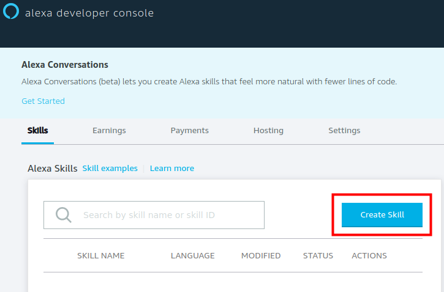
3. Enter a name and select a language. Make sure to set `Model` to `Custom` and `Host` to `Provision your own` and press `Create Skill`.
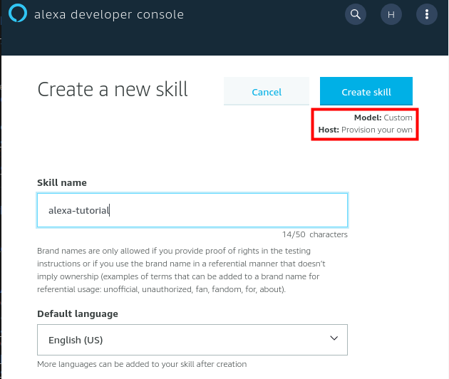
4. When promted for a template, choose `Start from Scratch`.
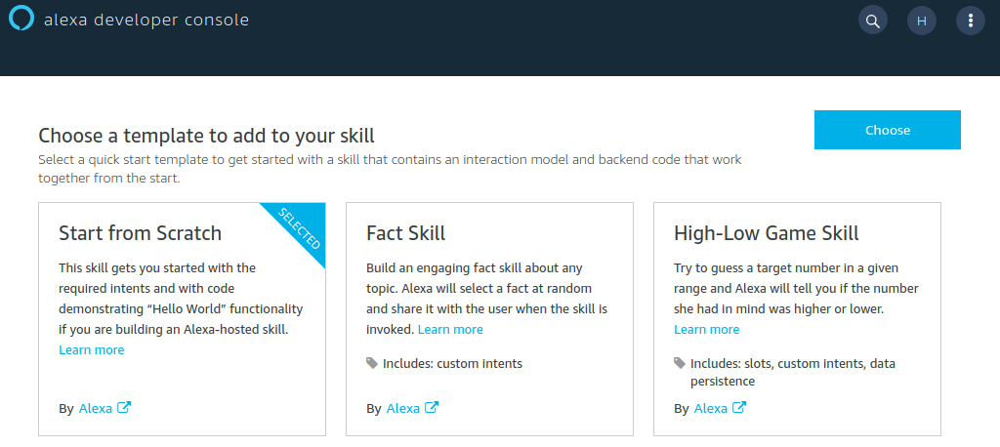
5. The new skill will then be created within a few seconds. After completion, the skill-dashboard is shown. There should be some green checkmarks when everything went well. 
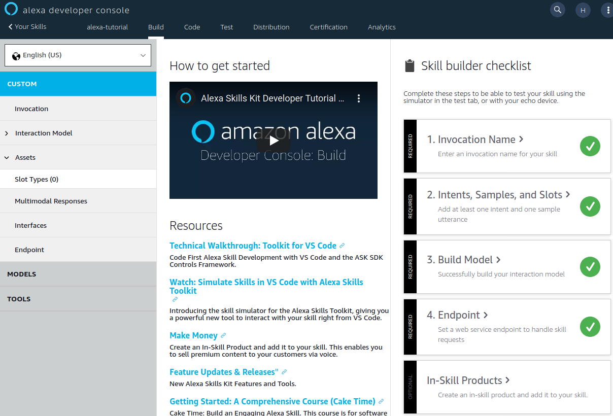

6. Go to `Invocation` and choose a Skill Invocation Name. Press `Save Model` and `Build Model` when done.
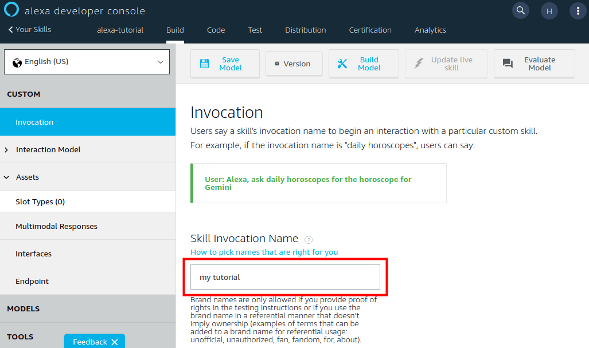

7. Go to the `Endpoint` page. Copy the Skill ID to `infrastructure/variables.tf` (variable `skill_id`). Ignore the other input fields for now.
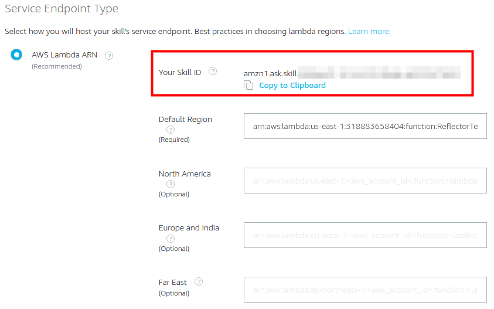

## Deploy Lambda Function

1. Open a terminal and change into the `infrastructure` folder. Execute `terraform apply` to set up all the components on AWS.
2. Open up your AWS console (the web-interface...) in a new browser tab as we will need both consoles (Alexa Developer and AWS) simultaneously. Go to the Lambda Service and check that the lambda-function was set up correctly.
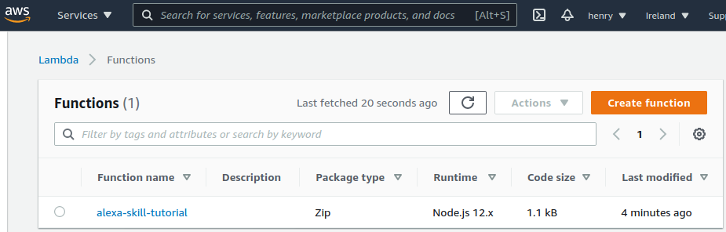
3. Open up the details page and copy the ARN shown in the top right corner.
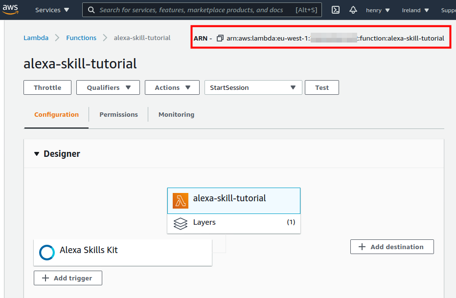
4. Go back to the `Endpoint` page in your [Alexa Developer Console](https://developer.amazon.com/alexa/console/ask) and paste the Lambda-ARN into the `Default Region` field. Do not forget to `Save Endpoints`!
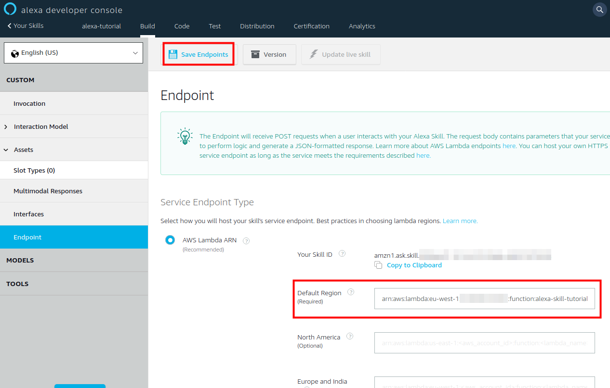

## Testing

1. Switch (again...) to the Lambda details page and select the `Test` button to create a new test event.
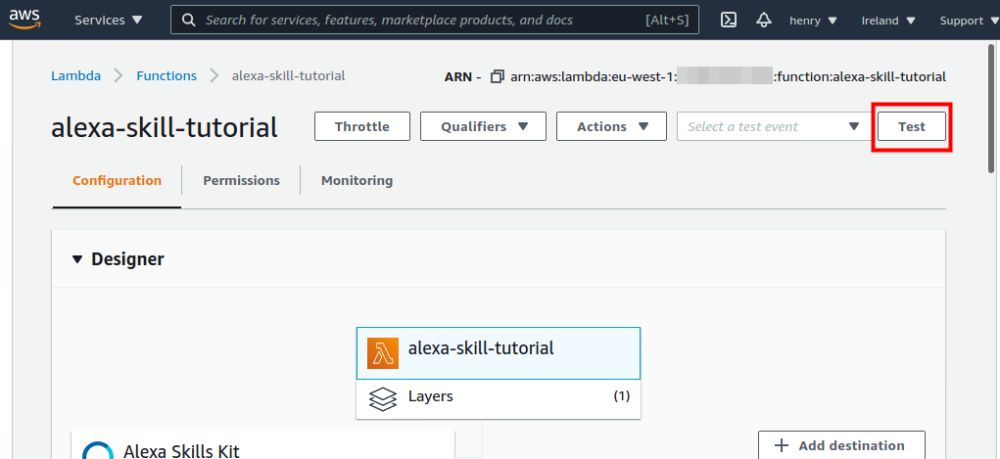

2. Choose the `alexa-skill-kit-start-session` event template, enter an event name and press `create`.
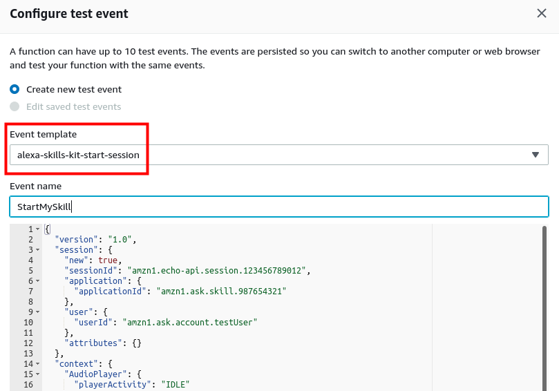

3. Press `Test` again with the previously created test event selected. You should now be able to see a successful execution of the lambda-function.
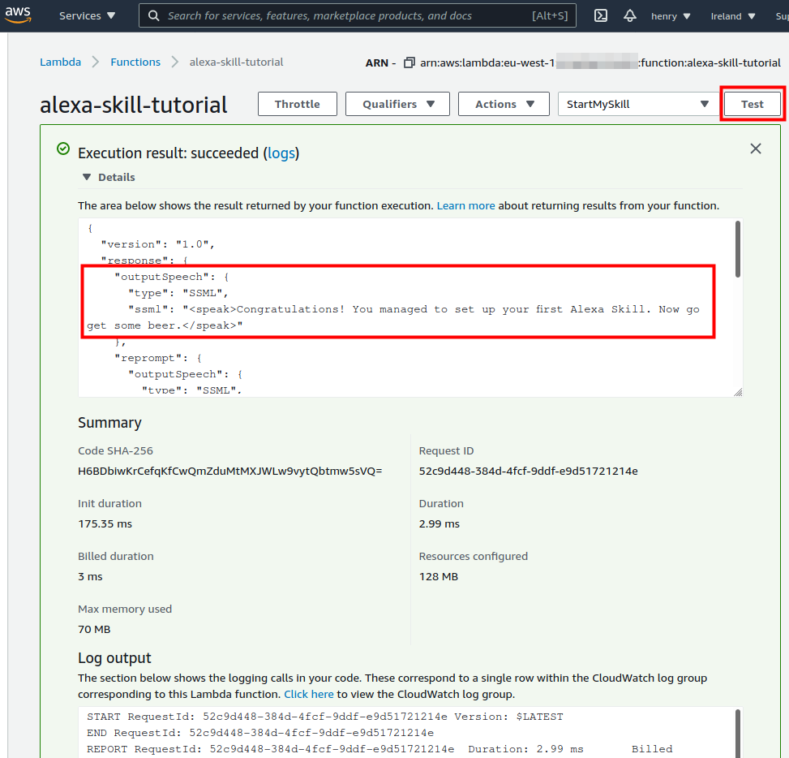

4. Now switch back to the `Test` page in your [Alexa Developer Console](https://developer.amazon.com/alexa/console/ask) and change `Skill testing is enabled in` to `Development`. Enabling microphone access is optional.
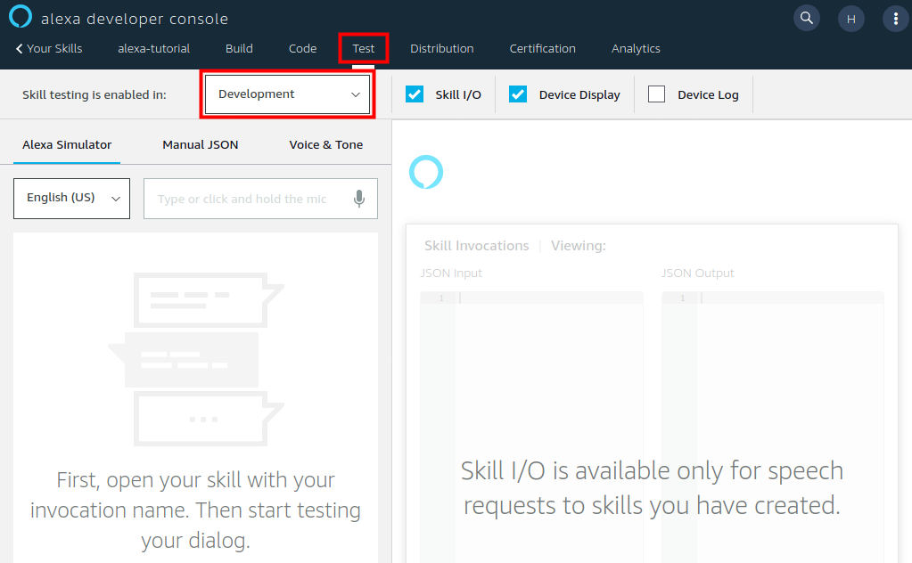

5. Speak (while pressing the microphone button) or type the skill invocation: `open my tutorial`. If everything went well, you can hear the responses that were defined in the RequestHandlers (`src/tutorial-skill.ts`). The request and response data (JSON) is also shown to the right and can be used for debugging purposes.
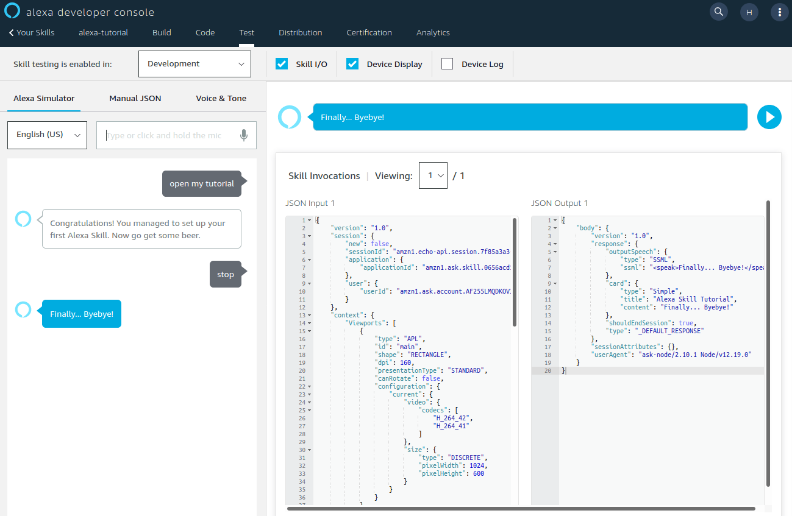

6. Back to the AWS Lambda Console: Switch to the monitoring tab and check that the endpoint was called successful. For a detailled analysis (error messages), open the corresponding Cloudwatch Log group and select the latest Log Stream.
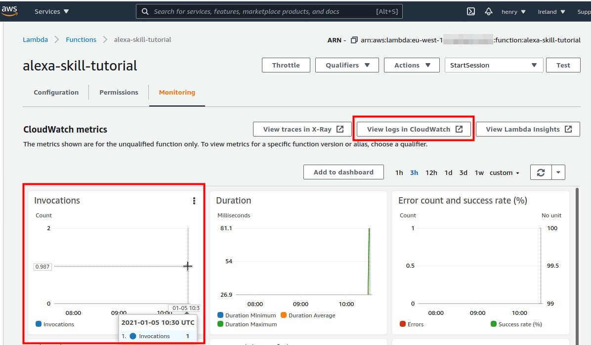

## Next Steps

1. Extend the Interaction Model with additional intents and utterances using the information provided on the [Alexa Developer Console](https://developer.amazon.com/alexa/console/ask).
2. Adapt the backend (Lambda-function) to your needs using [ASK SDK for Node.js](https://developer.amazon.com/en-US/docs/alexa/alexa-skills-kit-sdk-for-nodejs/overview.html)

## References

### Alexa Skill Development
- [Developing an Alexa Skill: Part 2, Deploying to AWS Using Terraform](https://www.adrianmilne.com/alexa-skill-part-2-aws-using-terraform/)
- [Develop Alexa Custom Skill with AWS Lambda to Control IoT Device](https://medium.com/coinmonks/alexa-custom-skill-with-aws-lambda-to-control-iot-device-68f37beac3fb)
- [Skill Sample : Smarthome Switch (Node.js)](https://github.com/alexa/skill-sample-nodejs-smarthome-switch)

### Typescript, Javascript for Alexa Skills

- [ASK SDK for Node.js](https://developer.amazon.com/en-US/docs/alexa/alexa-skills-kit-sdk-for-nodejs/overview.html)
- [Alexa Skills Kit SDK for Node.js](https://github.com/alexa/alexa-skills-kit-sdk-for-nodejs#readme)

- [Alexa Skill with TypeScript](https://github.com/xavidop/alexa-typescript-lambda-helloworld#lambda-function-in-typescript)
- [Tips and Tricks for Alexa Developers using Typescript](https://m.proxima.io/tips-and-tricks-for-alexa-developers-using-typescript-16c7a4176c79)
- [Alexa Skill With TypeScript – DZone Web Dev](https://graphicdon.com/2020/04/16/alexa-skill-with-typescript-dzone-web-dev/)

### Authentication, Account Linking
- [GitHub API Authentication using OAuth 2.0](https://insomnia.rest/blog/oauth2-github-api)
- [How to set up Account Linking for Alexa with Auth0 and Jovo](https://www.jovo.tech/tutorials/alexa-account-linking-auth0)